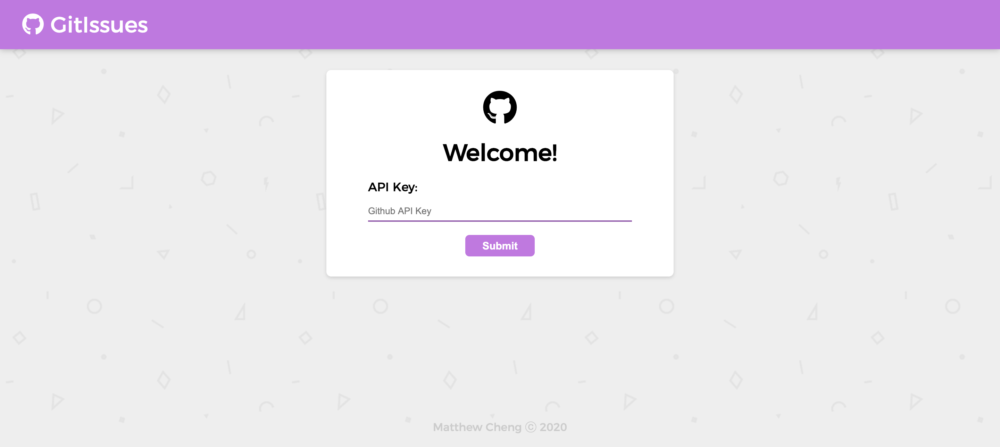

# GitIssues App

The GitIssues app consumes GitHub issues using the Github API to create a simple interface that will aid a product manager in prioritizing issues and/or enhancements for a given repository.

[LIVE DEMO](https://matthewkcheng.github.io/gitissues)

## Installation

After downloading the code, cd into the file location and run this in the terminal to get the app running locally.

```bash
keeper $ npm install
keeper $ npm start
```

## Usage

When you first open the app, you will see a credentials form.
You will need to submit an appropriate GitHub API key/Personal Access Token to log in. If you are unsure of how to obtain a token, please follow the link below.

[HOW TO GET PERSONAL ACCESS TOKEN](https://docs.github.com/en/github/authenticating-to-github/creating-a-personal-access-token)



Once a valid key is submitted, you will be sent to the user interface and all your repositories will be loaded on the left side of the interface.


When a repository is selected, the issues pertaining to that repository will be loaded on the right side of the interface.


From here, you are able to prioritize which issue is most important by simply dragging the issues to whatever order you like.


(Note: Data will also persist with the applications implementation of LocalStorage)

## Tech Stack
* React.JS
* Context API
* HTML5
* CSS3
* JavaScript

## Contributing
Pull requests are welcome. For major changes, please open an issue first to discuss what you would like to change.

Please make sure to update tests as appropriate.